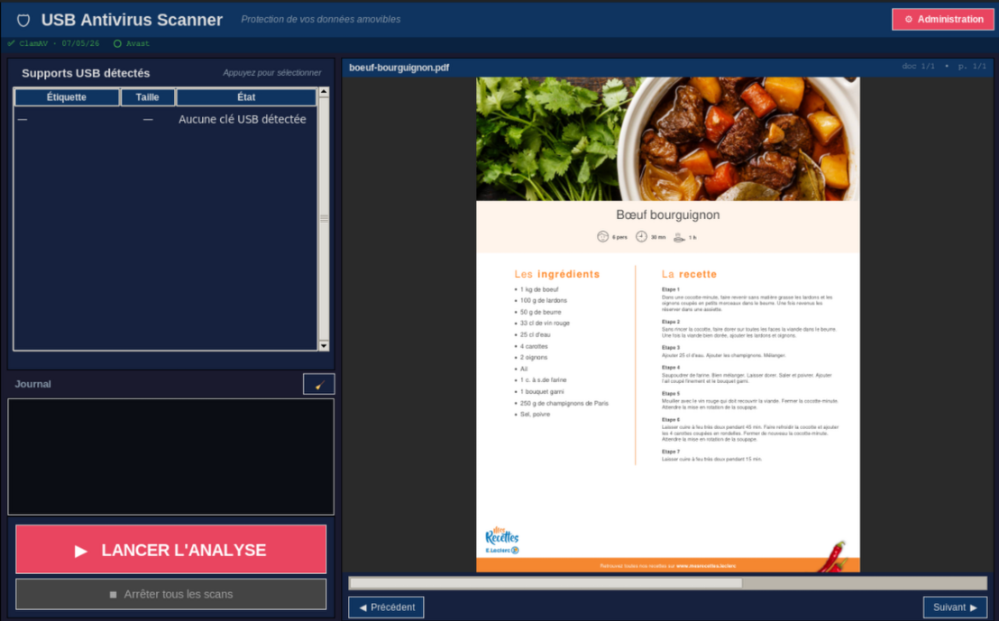

# 🛡 USB Antivirus Scanner

Station de décontamination antivirale pour supports USB, conçue pour fonctionner en mode kiosque (plein écran, sans interaction clavier nécessaire). L'interface affiche en permanence des documents PDF de sensibilisation ou de communication pendant que l'analyse se déroule en arrière-plan.

---

## Sommaire

- [Aperçu](#aperçu)
- [Arborescence du projet](#arborescence-du-projet)
- [Fonctionnalités](#fonctionnalités)
- [Prérequis](#prérequis)
- [Installation](#installation)
- [Créer l'ISO](#créer-liso)
- [Lancement](#lancement)
- [Interface utilisateur](#interface-utilisateur)
- [Panneau d'administration](#panneau-dadministration)
- [Visionneuse PDF](#visionneuse-pdf)
- [Moteurs antivirus](#moteurs-antivirus)
- [Structure des modules](#structure-des-modules)

---

## Aperçu

USB Antivirus Scanner est une application Python/Tkinter qui tourne en plein écran sur une station dédiée (ou en mode live depuis un ISO). Elle détecte automatiquement les clés USB branchées, les analyse en parallèle avec plusieurs moteurs antivirus (ClamAV, Avast, YARA), et affiche le résultat dans un journal horodaté. L'accès aux réglages est protégé par un code administrateur.

<div style="display: flex; align-items: center;">
  
</div>

---

## Arborescence du projet

```
.
├── code/
│   ├── admin_auth.py       # Authentification et panneau d'administration
│   ├── antivirus_manager.py# Gestion des moteurs antivirus installés
│   ├── config.py           # Chemins et constantes globales
│   ├── db_manager.py       # Mise à jour des bases de signatures
│   ├── gui.py              # Interface graphique principale (Tkinter)
│   ├── log_handler.py      # Journalisation et export PDF des sessions
│   ├── main.py             # Point d'entrée
│   ├── pdf_viewer.py       # Visionneuse PDF cyclique (PyMuPDF)
│   ├── scanner.py          # Moteur de scan et résultats
│   ├── usb_manager.py      # Détection et montage des partitions USB
│   └── utils.py            # Fonctions utilitaires partagées
├── iso/
│   ├── makefile            # Génération de l'ISO ou démarrage en mode live
│   └── xfce-64-bits/
│       └── forgeIsoXfce.sh # Script de construction de l'image XFCE 64 bits
├── pdf/
│   └── *.pdf               # Documents affichés en boucle (sensibilisation, communication…)
└── README.md
```

---

## Fonctionnalités

**Analyse USB**
- Détection automatique et en temps réel des clés USB branchées
- Sélection multi-supports : plusieurs clés peuvent être analysées simultanément (scans parallèles par threading)
- Modes de scan : rapide (*quick*) ou complet (*full*)
- Suppression optionnelle des fichiers infectés
- Statistiques cumulées par session (fichiers analysés, menaces détectées, hachages uniques)

**Moteurs antivirus**
- **ClamAV** — moteur open-source, mise à jour via `freshclam` ou depuis une clé USB
- **Avast** — moteur commercial (licence requise), mise à jour de la base VPS
- **YARA** — règles personnalisées, importables depuis GitHub ou une clé USB

**Interface**
- Affichage plein écran, adapté aux bornes en libre-service
- Journal d'activité colorisé en temps réel (info / avertissement / menace / ok)
- Bandeau d'état permanent des moteurs actifs
- Export du journal de session en PDF
- Visionneuse PDF cyclique pour diffusion de contenus de sensibilisation

**Administration (protégée par code)**
- Sélection des moteurs actifs et du mode de scan
- Mise à jour des bases de signatures (en ligne ou depuis USB)
- Planification automatique via crontab (ClamAV, Avast, YARA, signatures tierces)
- Export et purge des journaux
- Analyse système complète (ClamAV, chkrootkit)
- Changement du code administrateur
- Arrêt ou redémarrage propre de la station

---

## Prérequis

| Élément | Version minimale |
|---|---|
| Python | 3.9+ |
| Tkinter | inclus dans Python standard |
| ClamAV | `apt install clamav clamav-daemon` |
| PyMuPDF | `pip install pymupdf` |
| Pillow | `pip install pillow` |
| Avast (optionnel) | paquet `.deb` officiel + licence |

> L'application **doit être lancée avec les droits root** (`sudo`) pour accéder aux périphériques USB et exécuter les commandes système.

---

## Installation

```bash
# 1. Cloner le dépôt
git clone <url-du-depot>
cd usb-antivirus-scanner

# 2. Installer les dépendances Python
pip install pymupdf pillow

# 3. Installer ClamAV et mettre à jour la base virale
sudo apt install clamav clamav-daemon
sudo freshclam

# 4. (Optionnel) Placer vos documents PDF dans le dossier pdf/
cp mes_documents/*.pdf pdf/
```

---

## Créer l'ISO

Le `makefile` situé dans `iso/` permet de construire une image ISO bootable basée sur XFCE 64 bits, intégrant directement l'application. Deux modes sont disponibles :

```bash
cd iso

# Construire l'image ISO d'installation
make iso

# Démarrer directement en mode live (sans installation)
make live
```

Le script `xfce-64-bits/forgeIsoXfce.sh` prend en charge la construction de l'image de base, l'intégration des paquets nécessaires et la configuration du démarrage automatique de l'application.

---

## Lancement

```bash
# Depuis le dossier code/
sudo python3 main.py
```

Au premier démarrage, le code administrateur par défaut est **`0000`**. Il est **fortement conseillé** de le modifier immédiatement depuis le panneau d'administration (onglet 🔑 Sécurité).

---

## Interface utilisateur

L'écran est divisé en deux zones principales :

**Colonne gauche**
- Liste des supports USB détectés avec leur taille et leur état de montage
- Journal d'activité horodaté avec code couleur
- Boutons *Lancer l'analyse* / *Annuler*

**Colonne droite**
- Visionneuse PDF : affiche en boucle les documents du dossier `pdf/`, à raison d'une page toutes les 35 secondes

---

## Panneau d'administration

Accessible via le bouton **⚙ Administration** (en haut à droite) après saisie du code. Le panneau est organisé en onglets :

| Onglet | Contenu |
|---|---|
| 🔧 Moteurs | Activer/désactiver ClamAV, Avast, YARA — mode scan — suppression automatique |
| 📡 Supports | Vue exhaustive de tous les supports USB détectés |
| 🛡 ClamAV | Mise à jour en ligne ou depuis USB — signatures tierces |
| 🔐 Avast | Installation, licence, mise à jour de la base VPS |
| 🔍 YARA | Import de règles depuis GitHub ou depuis une clé USB |
| ⏰ Planification | Configuration des tâches crontab (freshclam, Avast, YARA…) |
| 🖥 Système | Mise à jour APT, analyse ClamAV système, chkrootkit |
| 📋 Journaux | Export vers USB, purge |
| 🔑 Sécurité | Changement du code administrateur |
| ⏻ Arrêt | Démontage propre des USB puis poweroff / reboot |
| 🚪 Quitter | Fermeture propre de l'application |

---

## Visionneuse PDF

Le dossier `pdf/` contient les documents diffusés en boucle sur la partie droite de l'écran. Ces documents sont destinés à la **sensibilisation** (bonnes pratiques informatiques, risques liés aux supports amovibles…) ou à la **communication** interne (affiches, notes d'information…).

- Les fichiers sont triés par ordre alphabétique et parcourus en cycle continu.
- Chaque page est affichée pendant **35 secondes**.
- Tout fichier `.pdf` déposé dans le dossier est automatiquement pris en compte au prochain cycle.
- Dépendances requises : `pymupdf` et `pillow`.

---

## Moteurs antivirus

### ClamAV
Moteur open-source intégré par défaut. La base de signatures est stockée dans `/var/lib/clamav` et peut être mise à jour :
- **En ligne** : via `freshclam`
- **Hors ligne** : depuis un fichier `.cvd` ou `.cld` présent sur une clé USB

### Avast
Moteur commercial optionnel. Nécessite l'installation du paquet Avast pour Linux et une licence valide. La base VPS peut être importée depuis une clé USB en environnement isolé.

### YARA
Moteur de détection par règles personnalisées. Les règles (`.yar` / `.yara`) peuvent être téléchargées depuis le dépôt [signature-base](https://github.com/Neo23x0/signature-base) sur GitHub ou importées manuellement depuis une clé USB.

---

## Sécurité

- L'application requiert les droits `root` pour monter les partitions USB et exécuter les commandes système.
- Le code administrateur est stocké sous forme de condensat SHA-256 dans `/etc/virusscanner/admin.json` (permissions `600`).
- La fermeture de la fenêtre principale est elle-même protégée par le code administrateur, rendant l'interface résistante aux manipulations non autorisées en contexte kiosque.

---

## Licence

TODO